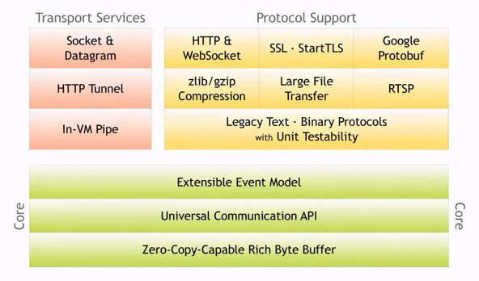
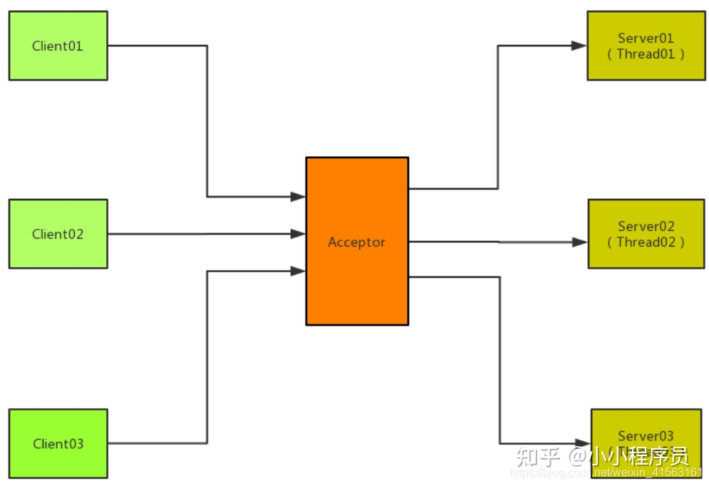
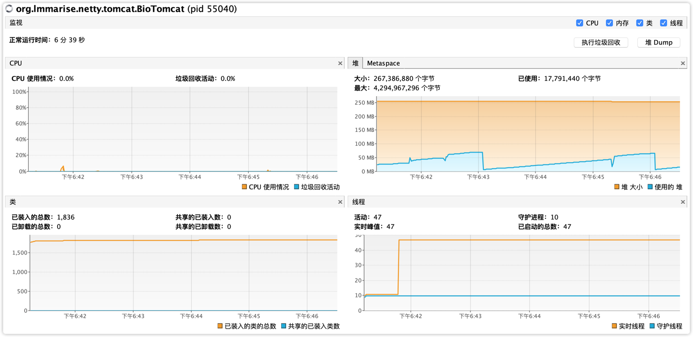
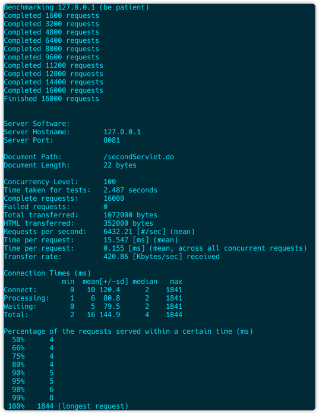
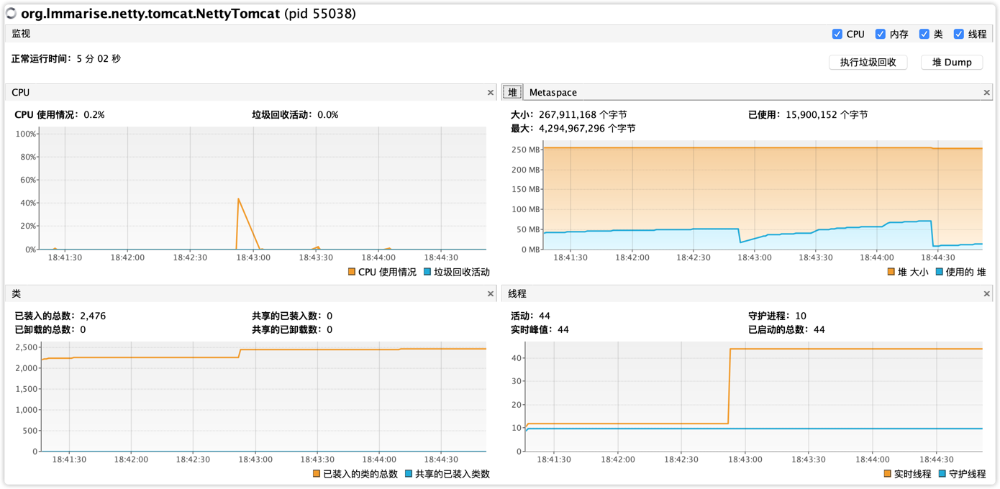

## netty-case
基于Netty开发应用。

### list1-io

主要演示Java中BIO、NIO、AIO的使用。

netty是基于nio的，为何Netty不使用AIO？
  1. Netty不看重Windows上的使用，而Linux没有异步，只有epoll的伪劣异步。因此，性能差异不大。 
  2. Netty用Reactor模型，AIO用Proactor模型。避免混乱，把AIO改造成Reactor模型，也就是把epoll绕了回来。 
  3. AIO接收数据需要预先分配缓存，NIO接收时才分配，对连接数大但流量小的情况，AIO浪费内存。 Linux上AIO不够成熟，处理回调结果跟不上处理需求，造成处理速度瓶颈。

### list2-tomcat-bio
基于Netty开发自己的web服务器，基于bio。

Acceptor线程模型： 
普通情况是来一个客户端连接分配一个线程去处理，Acceptor模型就是依靠线程池来进行处理。

优点： 
开发简单。

缺点： 
资源消耗明显，开销大。

### list3-tomcat-netty

基于Netty重构我们的BIO实现的tomcat。

### list4-netty-rpc
使用Netty模拟rpc框架工作。  
#### PS:  
里面有bug，在macOS下无法工作：io.netty.handler.codec.DecoderException: java.io.StreamCorruptedException: Unsupported version: 0
待我功力大增后回来修改。

### list5-netty-technique
测试case，演示Netty中用到的性能优化等技术。

### list6-netty-chat
使用Netty搭建im系统。

## 压测
### tomcat-bio
ab -n 16000 -c 100 -r http://127.0.0.1:8080/secondServlet.do

### tomcat-netty
ab -n 16000 -c 100 -r http://127.0.0.1:8081/secondServlet.do

