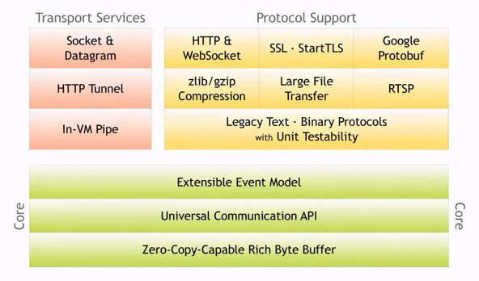
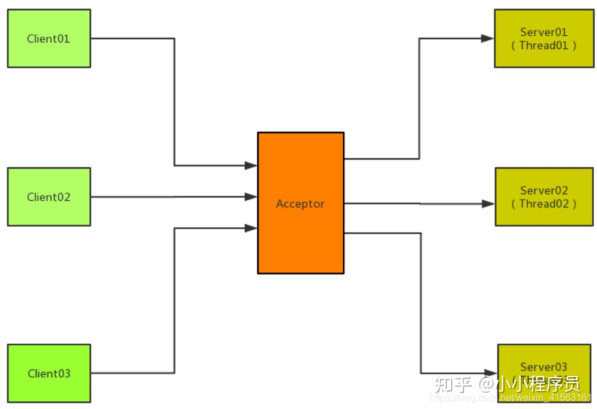

## netty-use
基于Netty开发框架或其它使用。

### list1-nio
netty是基于nio的，主要演示nio的使用和原理。  
为何Netty不使用AIO？
1. Netty不看重Windows上的使用，而Linux没有异步，只有epoll的伪劣异步。因此，性能差异不大。 
2. Netty用Reactor模型，AIO用Proactor模型。避免混乱，把AIO改造成Reactor模型，也就是把epoll绕了回来。 
3. AIO接收数据需要预先分配缓存，NIO接收时才分配，对连接数大但流量小的情况，AIO浪费内存。 Linux上AIO不够成熟，处理回调结果跟不上处理需求，造成处理速度瓶颈。

### list2-tomcat
基于Netty开发自己的web服务器，基于bio。

Acceptor线程模型： 
普通情况是来一个客户端连接分配一个线程去处理，Acceptor模型就是依靠线程池来进行处理。

优点： 
开发简单。

缺点： 
资源消耗明显，开销大。